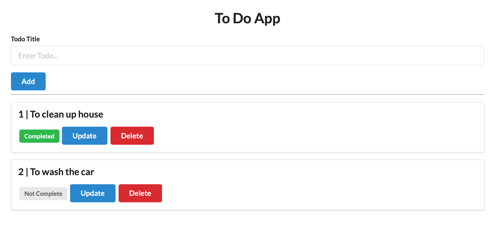

# PYTHON FLASK TODO APP
This is a traditional Python 3 TODO app with [Flask framework](https://flask.palletsprojects.com). This project is based on [Patrick Loeber's video](https://www.youtube.com/watch?v=3vfum74ggHE) analysing three Python frameworks for Web apps.

## Other Branches

This original project is extended in other branches.

- [unit-test](https://github.com/gabrielcostasilva/python-flask-todo/tree/unit-test) adds unit tests with Pytest.
- [docker-dev](https://github.com/gabrielcostasilva/python-flask-todo/tree/docker-dev) containerises the application with docker using a DEV server.
- [docker-prod](https://github.com/gabrielcostasilva/python-flask-todo/tree/docker-prod) uses Gunicorn as a production server for the containerised application.
- [mysql](https://github.com/gabrielcostasilva/python-flask-todo/tree/mysql) replaces SQLLite with MySQL as DB.

## Overview


The application uses the traditional MVC structure. Therefore, it consists of model, view and controller. Apart from the view, represented by the [base.html file](./templates/base.html), the code is entirelly implemented in a single file - [application.py](./application.py).

### The TODO model

```python
(...)

app = Flask(__name__) # (2)

(...)

db = SQLAlchemy(app) # (1)

(...)
```

The model is set as a subclass of a `Model`, defined by SQLAlchemy library. The model maps table columns and object attributes (ORM). One should create an instance of `SQLAlchemy` to having access to `Model` (1). Notice the instance uses the application instance as a parameter (2).


```python
class Todo(db.Model):
    id = db.Column(db.Integer, primary_key=True)
    title = db.Column(db.String(100))
    complete = db.Column(db.Boolean)
```

The TODO model consists of three attributes:
- `id` is a unique key representing each TODO.
- `title` represents the TODO itself.
- `complete` flags the completion status of a TODO.

### Routes (controller)

```python
(...)

@app.get("/")
def home():
    (...)

@app.post("/add")
def add():
    (...)

@app.get("/update/<int:todo_id>")
def update(todo_id):
    (...)

@app.get("/delete/<int:todo_id>")
def delete(todo_id):
    (...)
```

As a traditional CRUD, there are four routes - one for each CRUD behaviour. Decorators map routes to Python functions. 

> Remember that `app` is an instance of the `Flask` object. 

Each decorator sets the HTTP method to use, and the route. Routes that rely on parameters, such as `/update` and `/delete`, also define the parameter type and name. The same name is set in the function parameter list.

### View (webpage)

The webpage is a simple HTML 5 page with Jinja2 template language. The template language is used to dynamically render the TODO list.

```html

<div class="ui segment">
    <p class="ui big header">{{todo.id }} | {{ todo.title }}</p>

    
    <span class="ui gray label">Not Complete</span>
    
    <span class="ui green label">Completed</span>
    

    <a class="ui blue button" href="/update/{{ todo.id }}">Update</a>
    <a class="ui red button" href="/delete/{{ todo.id }}">Delete</a>
</div>

```

The code above starts and ends with a directive for repeting the nested code according to the number of elements in `todos`. It places the current value of `todo.id` and `todo.title`. It also styles the TODO completion according to its status.

> Styling is done by Semantic-UI framework.

```python
(...)

@app.get("/")
def home():
    todo_list = db.session.query(Todo).all()
    return render_template("base.html", todos=todo_list) # (1)

(...)
```

The route `/` creates the `todos` variable the template uses (1). The variable is a list of the TODO model. 

The template is called either by `render_template("base.html", todos=todo_list)` or by `redirect(url_for("home"))`. `render_template()`, `redirect()` and `url_for()` are functions for the `flask` library.

### Data manipulation
Each route saves, retrieve, update, or delete data in a SQLite database using SQLAlchemy functions. 

- `db.create_all()` creates the table and its columns as defined in the `Model`.
- `db.session.query(Todo).all()` retrieves all rows from the table.
- `db.session.add(new_todo)` save the data.
- `db.session.commit()` flushes and commits the transaction.
- `db.session.query(Todo).filter(Todo.id == todo_id).first()` query the table following the TODO model, and retrieves the first match.
- `db.session.delete(todo)` delete the row.

## Dependencies
As expected, Flask is the main dependency for creating a Web app. The project also relies on [SQLAlchemy](https://www.sqlalchemy.org) for object-relational mapping. Finally, [Jinja2](https://palletsprojects.com/p/jinja/) provides a template engine for rendering dynamic content on webpages.

In addition, the webpage uses [Semantic UI](https://semantic-ui.com) for content styling.

Please check out the [requirements.txt](./requirements.txt) file for additional dependencies.


## Running the Project Locally
1. Clone the project locally

```
git clone https://github.com/gabrielcostasilva/python-flask-todo.git
```

2. In the project folder, create and activate a virtual environment

```
python3 -m venv venv
source venv/bin/activate

```

3. Install dependencies

```
pip install -r requiments.txt
```

4. Start the application

```
python3 application.py
```

5. Access the app with your browser at `http://localhost:5000`

## Additional References

- [Deploy to AWS Elastic Beanstalk](https://testdriven.io/blog/flask-elastic-beanstalk/)
